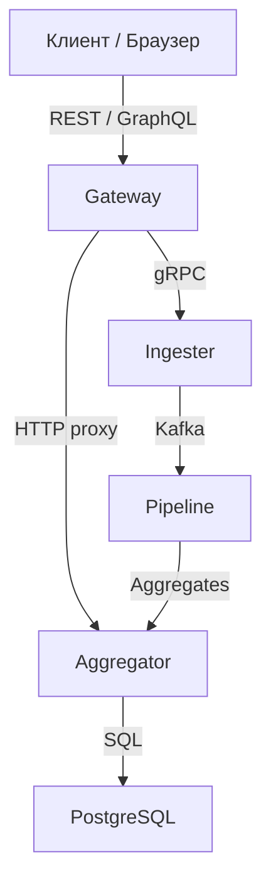

# 🇬🇧 QoS Pipeline / 🇷🇺 QoS Pipeline

**🇬🇧** High‑performance observability platform for ingesting, processing, and analysing service‑level metrics (SLI/SLO/SLA) with a multi‑stage backpressure pipeline, GraphQL API, and PostgreSQL storage.  
**🇷🇺** Высокопроизводительная платформа наблюдаемости для приёма, обработки и анализа метрик уровня обслуживания (SLI/SLO/SLA) с многостадийным конвейером на backpressure, GraphQL API и хранением в PostgreSQL.

## 🇬🇧 Architecture / 🇷🇺 Архитектура

**🇬🇧** The platform consists of four microservices:  
**🇷🇺** Платформа состоит из четырёх микросервисов:

- **Gateway** – entry point for metrics ingestion and GraphQL queries.  
  **Gateway** – точка входа для приёма метрик и GraphQL‑запросов.
- **Ingester** – receives metrics via gRPC and publishes them to Kafka.  
  **Ingester** – принимает метрики через gRPC и публикует их в Kafka.
- **Pipeline** – multi‑stage processing with backpressure, normalisation, filtering, aggregation, and storage.  
  **Pipeline** – многостадийная обработка с backpressure: нормализация, фильтрация, агрегация, запись.
- **Aggregator** – stores aggregates in PostgreSQL and exposes GraphQL API for SLO analysis.  
  **Aggregator** – сохраняет агрегаты в PostgreSQL и предоставляет GraphQL API для анализа SLO.

## 🇬🇧 Quick Start / 🇷🇺 Быстрый старт

- [Launch Guide / Инструкция по запуску](launch.md)

## 🇬🇧 Documentation / 🇷🇺 Документация

- [Documentation Navigation / Навигация по документации](docs/index.md)
- [SRS: Observability / ТЗ: Наблюдаемость](docs/srs/observability.md)
- [SRS: Pipeline / ТЗ: Конвейер](docs/srs/pipeline.md)