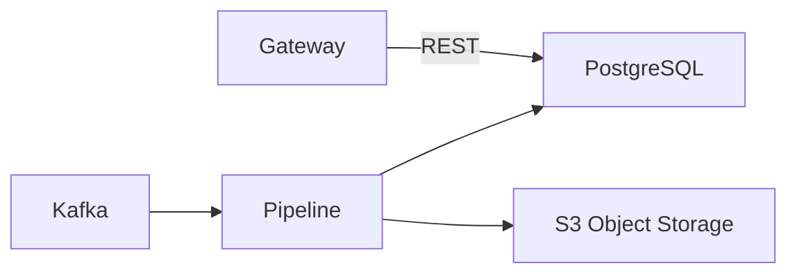
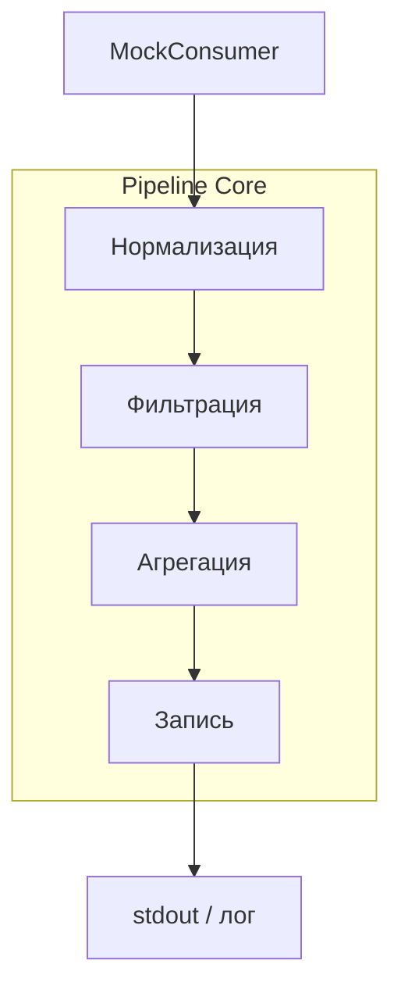

# 🇬🇧 Pipeline Architecture / 🇷🇺 Архитектура конвейера

## Назначение
Многостадийный асинхронный конвейер (Pipeline) — ядро системы `qos-pipeline`. Он принимает сырые метрики (в демо‑режиме – из MockConsumer, в production – из Kafka), нормализует их, фильтрует, агрегирует и записывает в аналитические хранилища. Конвейер гарантирует доставку данных при пиковых нагрузках благодаря встроенному backpressure и динамическому масштабированию воркеров.

## Общая схема (Production)



Конвейер расположен между Ingestion и Aggregation слоями. Его задача — превратить сырой поток событий в структурированные, обогащённые и готовые к аналитической обработке данные.

## Внутреннее устройство конвейера (текущая реализация)



В демонстрационном режиме конвейер получает данные из `MockConsumer`, который генерирует тестовые метрики. В production он будет заменён на Kafka‑consumer.

### Стадии

1. **Нормализация**  
   Приводит метрики к единому формату (`NormalizedMetric`).  
   Отбрасывает записи с отсутствующими обязательными полями.

2. **Фильтрация**  
   Удаляет дубликаты, выбросы и шум на основе конфигурируемых правил.  
   Использует кэш `timedcache` для дедупликации.

3. **Агрегация**  
   Собирает промежуточные агрегаты (суммы, счётчики, гистограммы) по временным окнам.  
   Применяет `statistics` для расчёта процентилей (p50, p95, p99).

4. **Запись**  
   Выводит готовые агрегаты в лог (для демо).  
   В production будет отправлять их в PostgreSQL и S3.  
   Использует `net/breaker` для защиты от каскадных сбоев.

## Backpressure и масштабирование

Конвейер построен на `net/backpressure`. Между стадиями стоят буферизированные каналы ограниченной ёмкости. Когда канал заполнен, стадия-отправитель автоматически блокируется, предотвращая неконтролируемый рост памяти.  
Количество воркеров на каждой стадии задаётся конфигурацией и может динамически меняться через административный API (в перспективе).

## Отказоустойчивость

- При падении любого воркера конвейер перезапускает его без потери сообщений (благодаря at‑least‑once семантике Kafka в production).
- Все состояния (окна агрегации, кэш дедупликации) хранятся in‑memory (в перспективе — в Redis).
- Circuit Breaker защищает запись в PostgreSQL и S3 от каскадных сбоев.

## Интеграция с другими сервисами

| Сервис | Роль |
|--------|------|
| **Ingester** | Поставляет сырые метрики через Kafka |
| **Aggregator** | Получает агрегаты и финализирует SLO/SLI расчёты |
| **Gateway** | Предоставляет REST API для управления конвейером и просмотра метрик |
| **PostgreSQL** | Хранит конфигурации, агрегаты, результаты SLO |
| **S3** | Долговременное хранение сырых логов и отчётов |

## Конфигурация

Параметры конвейера (размеры буферов, количество воркеров, правила фильтрации) задаются через YAML‑файл и могут быть переопределены через переменные окружения с префиксом `QOS_`.

## Пример конфигурации

```yaml
pipeline:
  stages:
    normalize:
      workers: 4
      buffer: 1000
    filter:
      workers: 2
      buffer: 500
    aggregate:
      workers: 4
      buffer: 2000
    write:
      workers: 1
      buffer: 1000
```

## Тестирование

Критические пути конвейера покрыты интеграционными тестами с использованием `testify/suite`. Тесты имитируют нагрузку, проверяют backpressure и корректность агрегаций.
